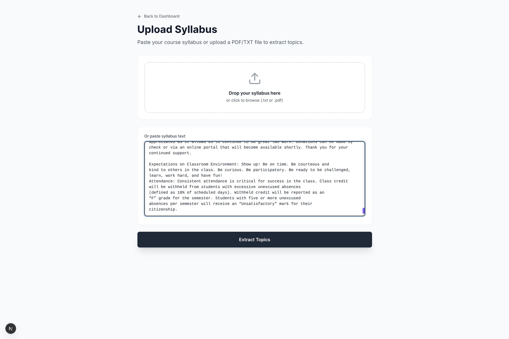
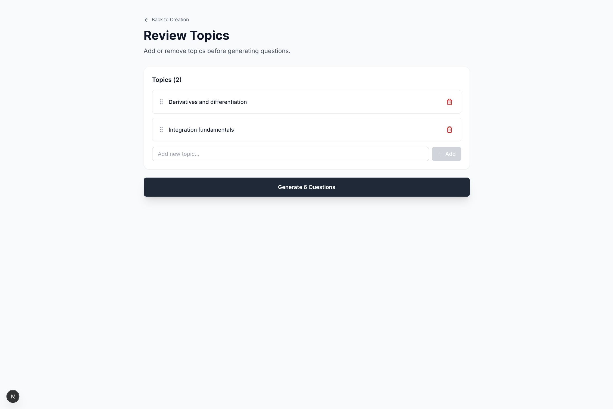
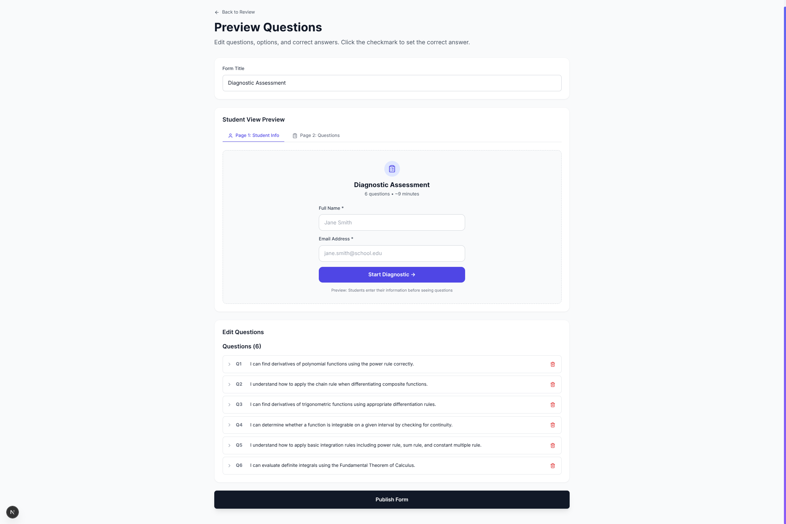
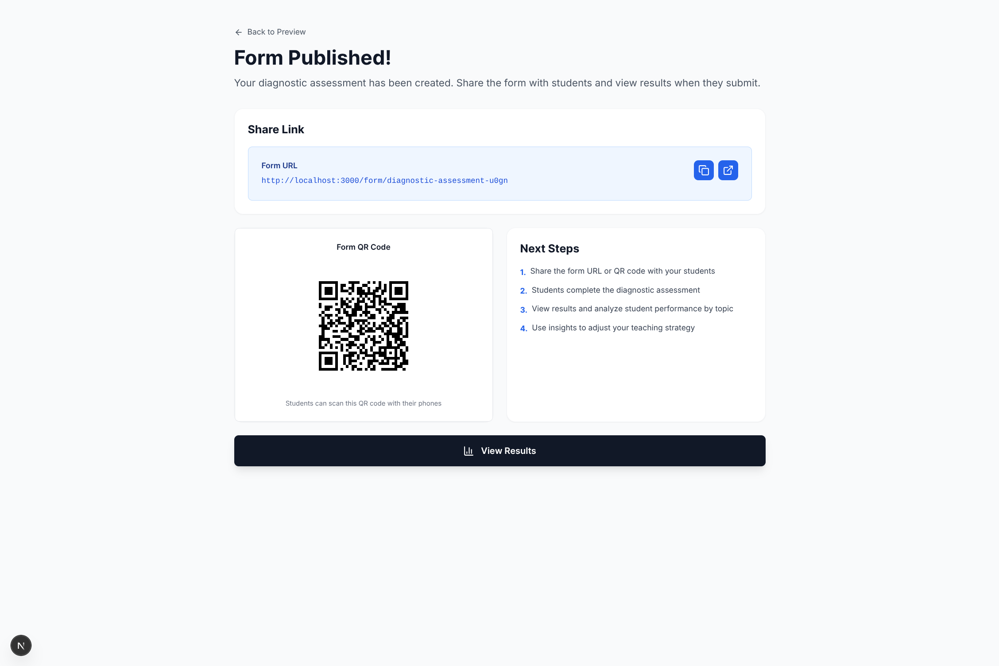
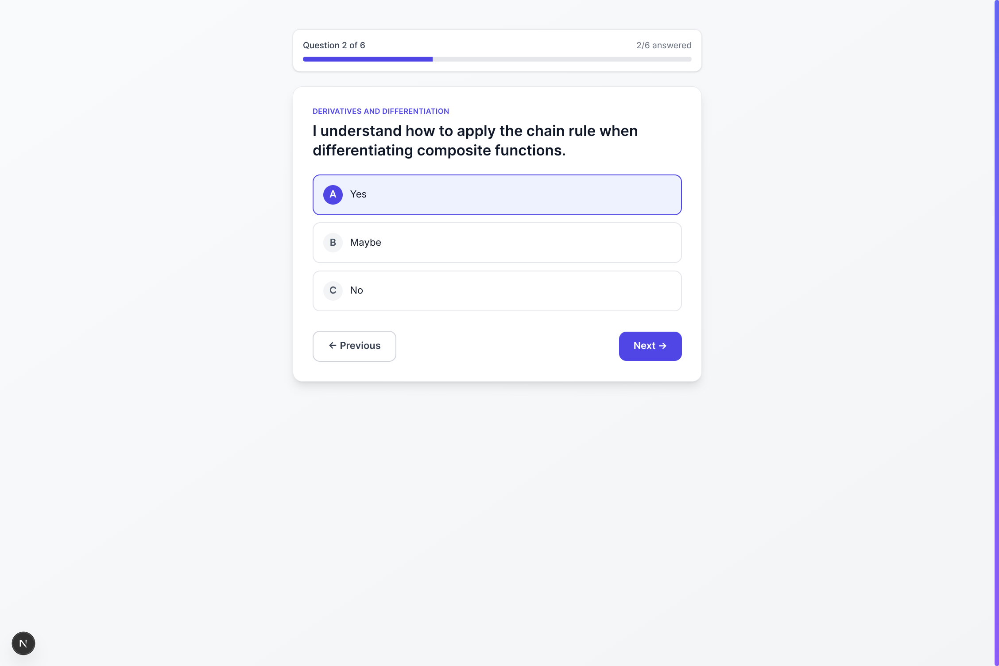
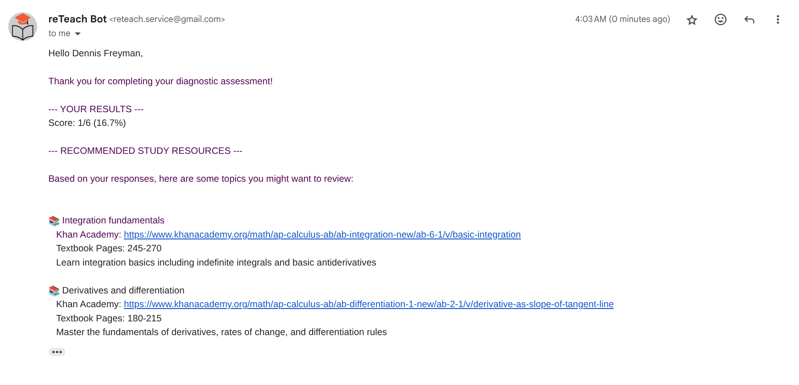
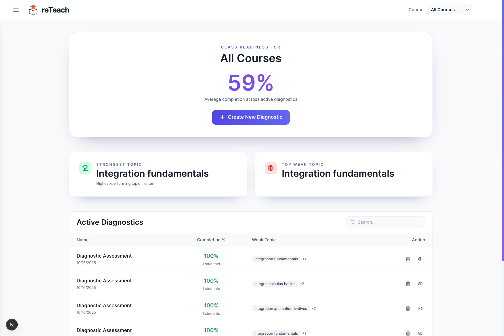
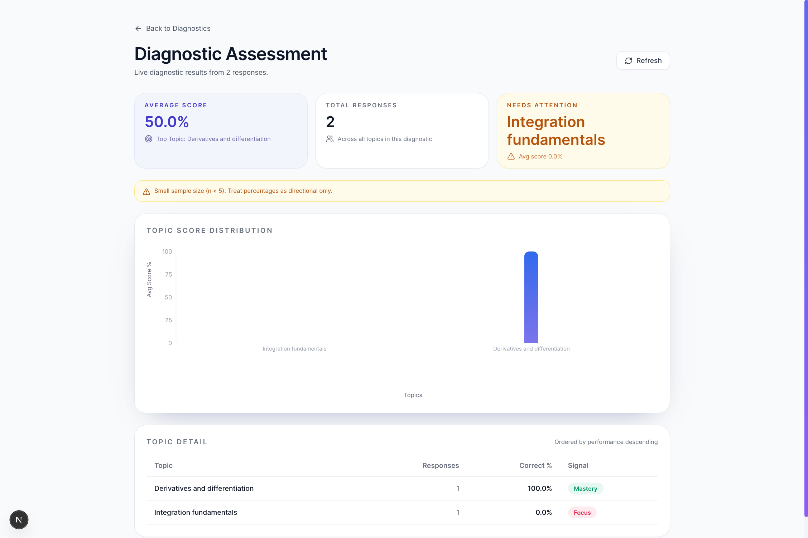

<div align="center">
  

  # reTeach

  [](https://opensource.org/licenses/MIT)
  [](https://nextjs.org/)
  [](https://fastapi.tiangolo.com/)
  [](https://github.com/Hadeva-Dev/reTeach)
  [](https://github.com/Hadeva-Dev/reTeach)

  ### Intelligent diagnostic assessment platform for educators
</div>

Transform your course syllabus into personalized diagnostic assessments in minutes. Using AI, reTeach generates topic-specific questions, analyzes student performance, and automatically sends tailored study resources via email.

---

## Features

- **AI-Powered Question Generation** - Automatically creates diagnostic questions from your syllabus
- **Real-Time Analytics** - Track student performance by topic with interactive dashboards
- **Automated Study Resources** - Students receive personalized Khan Academy links for weak topics
- **Topic-Based Analysis** - Identify knowledge gaps across your entire course
- **Easy Sharing** - Share assessments via link or QR code
- **Mobile Friendly** - Works seamlessly on any device

---

## Workflow

### 1. Upload Syllabus & Extract Topics

Upload your course syllabus and let AI extract the main topics and structure.



---

### 2. Review Topics

Review and customize the extracted topics before generating questions.



---

### 3. Preview Questions

AI generates 3 questions per topic. Review and edit as needed.



---

### 4. Publish & Share

Publish your diagnostic and share it with students via link or QR code.



---

### 5. Student Experience

Students complete the assessment with a clean, simple interface.




---

### 6. Automated Feedback

Students receive personalized study resources via email immediately after submission.



---

### 7. View Results

Access comprehensive analytics showing performance by topic and identifying weak areas.





---

## Technology Stack

**Frontend**
- Next.js 15
- TypeScript
- Tailwind CSS
- Recharts

**Backend**
- FastAPI (Python)
- Supabase
- Anthropic Claude
- SMTP

---

## Installation

### Prerequisites

- Node.js 18+
- Python 3.10+
- Supabase account
- Anthropic API key
- SMTP credentials

### Frontend Setup

```bash
git clone https://github.com/Hadeva-Dev/reTeach.git
cd reTeach
npm install
cp .env.example .env.local
# Edit .env.local with your API URL
npm run dev
```

### Backend Setup

```bash
cd backend
python -m venv venv
source venv/bin/activate
pip install -r requirements.txt
cp .env.example .env
# Edit .env with your credentials
uvicorn app.main:app --reload --port 8000
```

---

## Environment Variables

**Frontend (.env.local)**
```bash
NEXT_PUBLIC_API_URL=http://localhost:8000
```

**Backend (.env)**
```bash
SUPABASE_URL=your_supabase_url
SUPABASE_KEY=your_supabase_anon_key
ANTHROPIC_API_KEY=your_anthropic_api_key
SMTP_HOST=smtp.gmail.com
SMTP_PORT=587
BOT_EMAIL=your_email@gmail.com
BOT_PASSWORD=your_app_password
```

---

## License

This project is licensed under the MIT License - see the [LICENSE](LICENSE) file for details.

---

## Support

- Bug Reports: [GitHub Issues](https://github.com/Hadeva-Dev/reTeach/issues)
- Discussions: [GitHub Discussions](https://github.com/Hadeva-Dev/reTeach/discussions)

---

<div align="center">
  <sub>Built by <a href="https://github.com/zarfix123">Dennis</a> & <a href="https://github.com/jappabl">Hao</a></sub>
  <br>
  <sub><a href="https://www.linkedin.com/in/dennis-freyman/">Dennis on LinkedIn</a> • <a href="https://www.linkedin.com/in/haolinpacific/">Hao on LinkedIn</a></sub>
</div>
