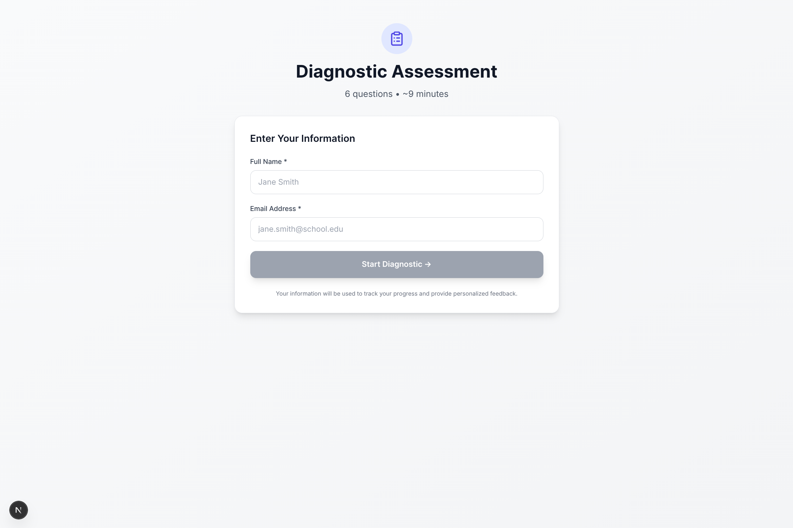

<div align="center">
  

  # reTeach

  [](https://opensource.org/licenses/MIT)
  [](https://nextjs.org/)
  [](https://fastapi.tiangolo.com/)
  [](https://vercel.com)
  [](https://github.com/Hadeva-Dev/reTeach)
  [](https://github.com/Hadeva-Dev/reTeach)

  ### Intelligent diagnostic assessment platform for educators

  **🚀 Deployed on Vercel** - Experience blazing-fast performance and seamless scalability
</div>

Transform your course syllabus into personalized diagnostic assessments in minutes. Using AI, reTeach generates topic-specific questions, analyzes student performance, and automatically sends tailored study resources via email.

---

## Features

- **AI-Powered Question Generation** - Automatically creates diagnostic questions from your syllabus
- **Real-Time Analytics** - Track student performance by topic with interactive dashboards
- **Automated Study Resources** - Students receive personalized Khan Academy links for weak topics
- **Topic-Based Analysis** - Identify knowledge gaps across your entire course
- **Easy Sharing** - Share assessments via link or QR code
- **Mobile Friendly** - Works seamlessly on any device

---

## Workflow

### 1. Upload Syllabus & Extract Topics

Upload your course syllabus and let AI extract the main topics and structure.


---

### 2. Review Topics

Review and customize the extracted topics before generating questions.


---

### 3. Preview Questions

AI generates 3 questions per topic. Review and edit as needed.


---

### 4. Publish & Share

Publish your diagnostic and share it with students via link or QR code.


---

### 5. Student Experience

Students complete the assessment with a clean, simple interface.




---

### 6. Automated Feedback

Students receive personalized study resources via email immediately after submission.


---

### 7. View Results

Access comprehensive analytics showing performance by topic and identifying weak areas.


---

## Technology Stack

**Frontend**
- Next.js 15
- TypeScript
- Tailwind CSS
- Recharts
- **Deployed on Vercel** for optimal performance and global CDN delivery

**Backend**
- FastAPI (Python)
- Supabase
- Anthropic Claude
- SendGrid / SMTP
- **Deployed on Railway** for reliable Python hosting

---

## Quick Start

### Prerequisites

- Node.js 18+
- Python 3.10+
- Accounts: Supabase, Anthropic, SendGrid (or Gmail)

### Local Development

**1. Clone and Install**
```bash
git clone https://github.com/Hadeva-Dev/reTeach.git
cd reTeach

# Install frontend dependencies
npm install

# Install backend dependencies
cd backend
python -m venv venv
source venv/bin/activate  # On Windows: venv\Scripts\activate
pip install -r requirements.txt
cd ..
```

**2. Configure Environment**
```bash
# Copy example files
cp .env.example .env.local
cp backend/.env.example backend/.env

# Edit .env.local and backend/.env with your credentials
# See Environment Variables section below
```

**3. Start Development Servers**
```bash
# Terminal 1: Start backend
cd backend
source venv/bin/activate
uvicorn app.main:app --reload --port 8000

# Terminal 2: Start frontend
npm run dev
```

Visit [http://localhost:3000](http://localhost:3000)

---

## Environment Variables

### Frontend (`.env.local`)

Copy `.env.example` and fill in:

```bash
# Supabase
NEXT_PUBLIC_SUPABASE_URL=your_supabase_url
NEXT_PUBLIC_SUPABASE_ANON_KEY=your_supabase_anon_key
SUPABASE_SERVICE_ROLE_KEY=your_service_role_key

# Backend API
NEXT_PUBLIC_BACKEND_URL=http://localhost:8000

# SendGrid (optional for frontend)
SENDGRID_API_KEY=your_sendgrid_key
FROM_EMAIL=your_email@domain.com

# Google OAuth (optional)
GOOGLE_CLIENT_ID=your_client_id
GOOGLE_CLIENT_SECRET=your_client_secret
```

### Backend (`backend/.env`)

Copy `backend/.env.example` and fill in:

```bash
# Supabase
SUPABASE_URL=your_supabase_url
SUPABASE_KEY=your_supabase_anon_key

# Anthropic
ANTHROPIC_API_KEY=your_anthropic_key

# SendGrid (recommended for production)
SENDGRID_API_KEY=your_sendgrid_key
FROM_EMAIL=your_email@domain.com

# Frontend URL (for generating shareable links)
FRONTEND_URL=http://localhost:3000

# CORS (add your frontend URL)
CORS_ORIGINS=http://localhost:3000,http://localhost:5173

# Application Settings
ENVIRONMENT=development
DEBUG=true
```

**Note**: For Gmail SMTP alternative (development only), see `backend/.env.example`

---

## Deployment

### Production Deployment

reTeach is designed for:
- **Frontend**: Vercel (Next.js optimized)
- **Backend**: Railway (Python friendly)

📖 **Full deployment guide**: [DEPLOYMENT.md](./DEPLOYMENT.md)

### Quick Deploy Buttons

Frontend (Vercel):
[](https://vercel.com/new/clone?repository-url=https://github.com/Hadeva-Dev/reTeach)

Backend (Railway):
[](https://railway.app/new/template)

**Important**: After deploying, see [SECURITY_NOTICE.md](./SECURITY_NOTICE.md) for credential management

---

## Project Structure

```
reTeach/
├── src/                    # Next.js frontend
│   ├── app/               # App router pages
│   ├── components/        # React components
│   └── lib/              # Utilities & API client
├── backend/               # FastAPI backend
│   └── app/
│       ├── routers/      # API endpoints
│       ├── services/     # Business logic
│       ├── models/       # Data models
│       └── utils/        # Helpers
├── public/               # Static assets
├── .env.example          # Frontend env template
├── backend/.env.example  # Backend env template
├── DEPLOYMENT.md        # Deployment guide
└── SECURITY_NOTICE.md   # Security checklist
```

---

## License

This project is licensed under the MIT License - see the [LICENSE](LICENSE) file for details.

---

## Support

- Bug Reports: [GitHub Issues](https://github.com/Hadeva-Dev/reTeach/issues)
- Discussions: [GitHub Discussions](https://github.com/Hadeva-Dev/reTeach/discussions)

---

<div align="center">
  <sub>Built by <a href="https://github.com/zarfix123">Dennis</a> & <a href="https://github.com/jappabl">Hao</a></sub>
  <br>
  <sub><a href="https://www.linkedin.com/in/dennis-freyman/">Dennis on LinkedIn</a> • <a href="https://www.linkedin.com/in/haolinpacific/">Hao on LinkedIn</a></sub>
</div>
